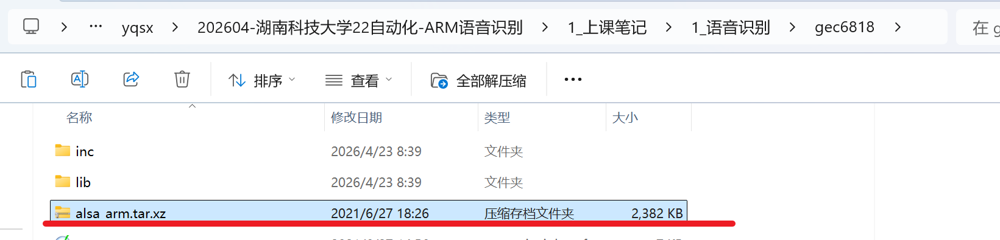

### 语音识别

==使用的是离线库，不能联网。==

### 一、 安装32位程序库(连网)

```
sudo apt update
sudo apt install libc6-i386
```

 

 ubuntu右上角有这个网络标志就是联网成功了。 

### 二、 网络设置(断开因特网)

```
接网线：把开发板与PC机用网线直接连接起来(记得把wifi关掉)
设置ubuntu与开发板的IP地址

sudo ifconfig ens33 192.168.2.10 up(ubuntu中)

ifconfig eth0 192.168.2.110 netmask 255.255.255.0 up (开发板上)

可以通过ifconfig查看IP是否设置成功。

测试开发板与ubuntu是否互通：
在开发板上执行指令(开发板ping虚拟机IP)
	ping 192.168.2.10

在ubuntu中执行指令(虚拟机ping开发板IP)
	ping 192.168.2.110
	
问题: 网络配置完毕依然ping不通
	1、把电脑的防火墙关闭
	2、换一根网线试一下
```

 

 


### 三、 语音识别服务端搭建

```c
1、设置ubuntu的系统时间，设置到2017年1月1号
	sudo date -s "2017-1-1"
	使用date指令确认是否修改成功

2、进入 (语音识别/x86/bin) 目录，执行语音识别库程序
	./asr_record_demo (这是语音识别服务器，要先运行着，开发板上的客户端程序才能连接成功)
	如果正常，会出现如下提示：
	构建离线识别语法网络...
	构建语法成功！ 语法ID:cmd
	离线识别语法网络构建完成，开始识别...
	wait for connecting ...
```

 

 

### 四、 通过U盘发送alsa库到开发板 

```
a.把alsa库拷贝到U盘中

b.把U盘插入到开发板，把U盘中的alsa_arm.tar.xz复制到你的工作目录
   比如我的是/home/xqh
   开发板执行命令
		cd  /mnt/udisk
		cp alsa_arm.tar.xz /home/xqh/
        cd /home/xqh/
   
c.解压alsa库到/usr/local/(必须是这个路径)
	进入自己的工作目录，eg:cd /home/xqh
	tar xvf alsa_arm.tar.xz -C /usr/local/ (必须是这个路径)

配置环境变量(每次关机/重启开发板后, 配置失效)：
export LD_LIBRARY_PATH=$LD_LIBRARY_PATH:/usr/local/alsa_arm/lib/

export PATH=$PATH:/usr/local/alsa_arm/bin/

```

   

 

 

 


### 五、测试

```
将语音识别/gec6818/voicectl (可执行程序)下载到开发板上运行
```

 

### 六、增加新的语音指令 

```
进入语音识别/x86/bin
	打开cmd.bnf, 编辑指令：
	语音指令的格式如下：
    内容!id(编号)
    指令与指令之间用|隔开
    例：
    <cmd>:hello!id(110)|开窗!id(1);
    如果收到指令后，需要播放某种音频文件，可以在代码中调
    用system函数
    例：
    if (id == 100)
    {
    	printf("aaaaaaaaaaaaaa\n");
    }
```


