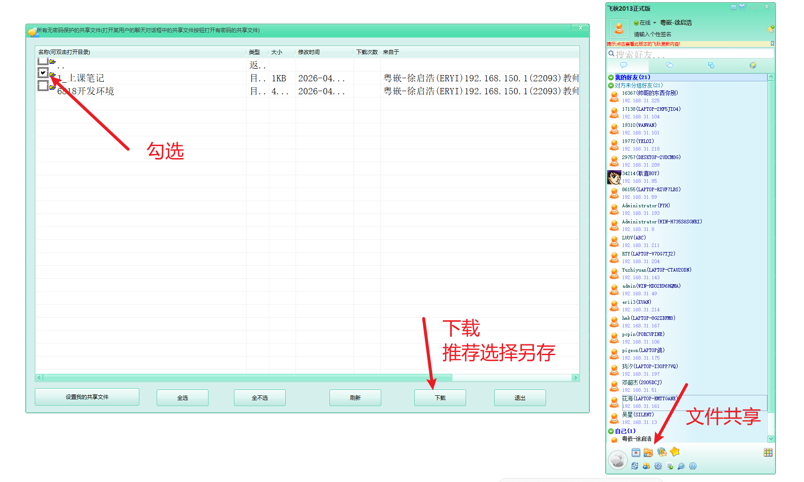
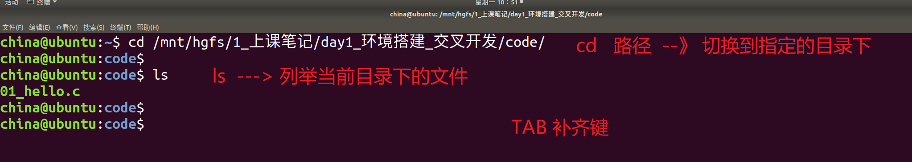
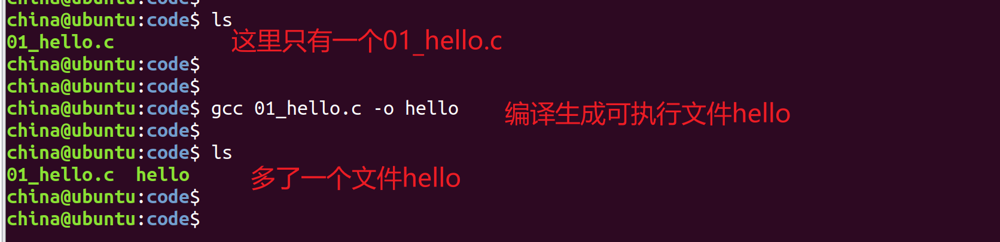
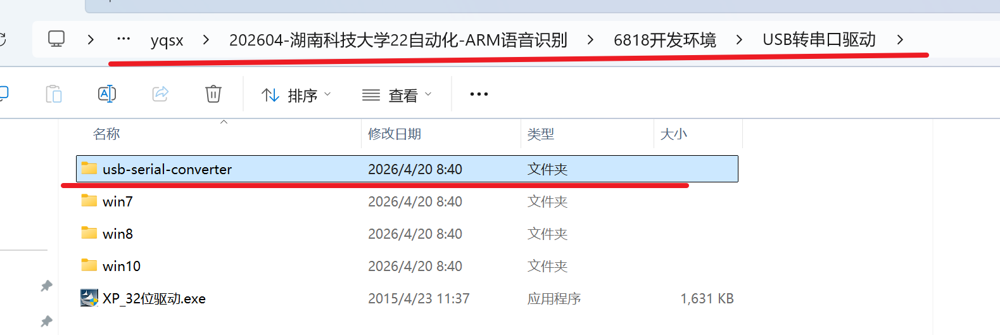
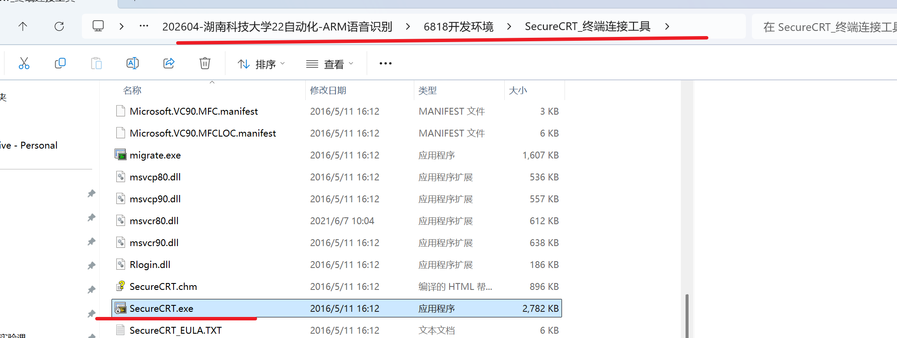
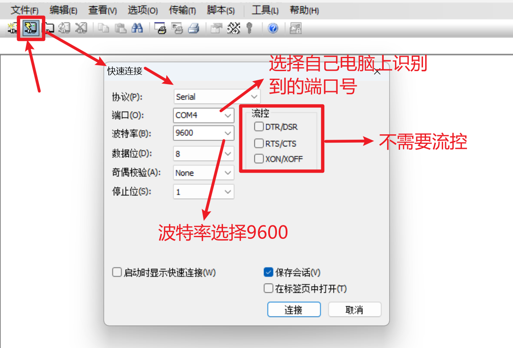
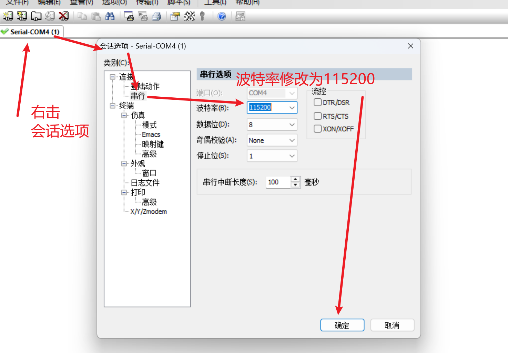
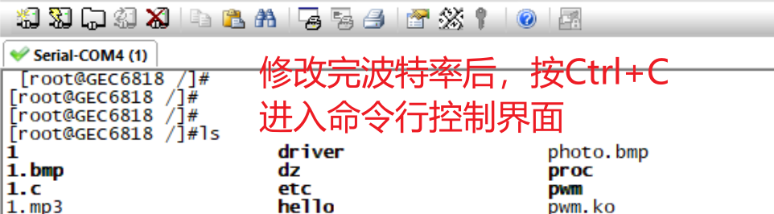
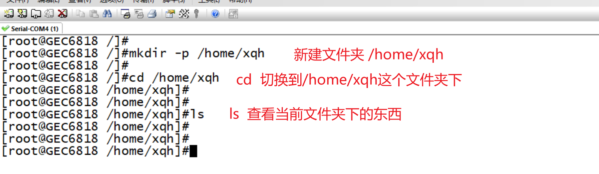
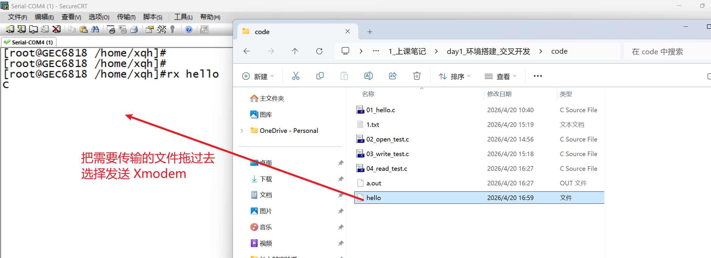

### 零、个人介绍

我是来自广州粤嵌通信科技股份有限公司湖南分公司的**徐启浩**

### 一、文件下载

 

### 二、项目介绍

我们这几天会在GEC6818开发板上基于C语言实现一个语音识别项目。


### 三、Ubuntu程序开发流程

#### 3.1 编写程序

```c
#include <stdio.h>

int main()
{
    printf("hello world\n");

    return 0;
}
```

#### 3.2 编译程序

**代码需要放在共享文件夹**

编译:  把代码编译成机器可以识别的语言

编译器:  **gcc   GNU编译器集合**

在我们的共享文件夹下，找到我们写好的代码文件，之后进行编译

```c
常用命令格式:
	gcc  代码文件  -o  可执行文件的名称
意义:
	把某个/某些代码文件编译成一个可以执行的程序文件

如: gcc 01_hello.c -o hello
	对01_hello.c 进行编译，生成了一个可执行文件hello

注意:
	如果不加-o给可执行文件命名，则可执行文件默认命名为: a.out
```

#### 3.3 执行程序

我们在Ubuntu中使用终端进入到共享文件夹，找到我们编译好的程序文件，并执行

终端: 是用户和系统之间的桥梁，它会解析用户的输入，从而做出对应的操作

**Ubunt桌面空白处右击  ---》 打开终端**

```c
命令格式:
	./可执行文件
意义:
	执行当前目录下的某个文件

如:
	./hello
	执行当前目录下hello这个文件
```

#### 4.4 虚拟机操作演示

**step1: 进入到共享文件夹中找到程序文件**

==cd  /mnt/hgfs/xxx   ---> xxx是你共享文件夹的名字==

 

**step2: 编译程序**

 

**step3: 执行程序**


### 四、文件IO

Linux下一切皆文件(设计逻辑、理念)

操作系统把操作文件的底层实现封装起来了，提供了一些接口给我们使用

如果想要访问文件，就需要提供一个 **进程文件表项的下标  ---》 文件描述符**，一个被打开的文件，都可以通过这个文件描述符来引用。

在Linux下，同一个进程中，唯一表示一个打开的文件，所有对文件的操作都需要使用到它。

#### 4.1 打开文件

```c
NAME
       open, creat - 用来 打开和创建 一个 文件或设备

SYNOPSIS 总览
       #includ e <sys/types.h>
       #include <sys/stat.h>
       #include <fcntl.h>

	功能: 打开或者创建一个文件
int open(const char *pathname, int flags);
	pathname: 需要打开或者创建的文件的路径
	flag: 标志位
		O_RDONLY  只读打开
		O_WRONLY  只写打开
		O_RDWR    读写打开
		必选标志位，什么方式打开文件，必须三选一
返回值:
	成功返回一个文件描述符，后续对文件的操作都需要使用到这个文件描述符
    失败返回-1，同时errno被设置
	错误码可以使用函数perror进行解析
```

#### 4.2 关闭文件

```c
NAME 名字
       close - 关闭一个文件描述符

SYNOPSIS 总览
       #include <unistd.h>

	功能: 关闭一个文件
int close(int fd);
	参数: 需要关闭文件对应的文件描述符
```

```c
#include <sys/types.h>
#include <sys/stat.h>
#include <fcntl.h>
#include <unistd.h>
#include <stdio.h>
#include <stdlib.h>


int main()
{
    //只读方式打开文件
    int fd = open("1.txt", O_RDONLY);
    if(fd == -1)
    {
        perror("open 1.txt error");
        exit(1);
    }
    printf("open 1.txt success\n");

    //关闭文件
    close(fd);

    return 0;
}
```

#### 4.3 文件写入

```c
NAME
       write -在一个文件描述符上执行写操作

概述
       #include <unistd.h>

功能: write  向文件描述符 fd 所引用的文件中写入 从 buf 开始的缓冲区中 count 字节的数据
ssize_t write(int fd, const void *buf, size_t count);
	fd: 需要进行写入数据的那个文件对应的文件描述符
	buf: 指向需要写入的数据对应的存储空间
	count: 需要写入的数据大小，单位是字节
返回值:
	成功返回实际写入的字节数
	失败返回-1，同时error被设置

示例:
#include <sys/types.h>
#include <sys/stat.h>
#include <fcntl.h>
#include <unistd.h>
#include <stdio.h>
#include <stdlib.h>


int main()
{
    //只写方式打开文件
    int fd = open("1.txt", O_WRONLY);
    if(fd == -1)
    {
        perror("open 1.txt error");
        exit(1);
    }
    printf("open 1.txt success\n");

    //往文件中写入数据
    char buf[10] = {"hello"};
    int ret = write(fd, buf, 5);
    if(ret == -1)
    {
        perror("write error");
        exit(1);
    }
    printf("write %d bytes datas\n", ret);

    //关闭文件
    close(fd);

    return 0;
}	
```

#### 4.4 文件读取

```c
NAME
       read - 在文件描述符上执行读操作

概述
       #include <unistd.h>

功能: read() 从文件描述符 fd 中读取 count 字节的数据并放入从 buf 开始的缓冲区中.
ssize_t read(int fd, void *buf, size_t count);
	fd: 需要进行读取操作的文件对应的文件描述符
	buf: 指向的空间用来存储从文件中读取到的内容
    count: 需要读取多少个字节的数据
返回值:
	成功返回实际读取到的字节数(<= count)
	失败返回-1，同时errno 被设置
```

```c
#include <sys/types.h>
#include <sys/stat.h>
#include <fcntl.h>
#include <unistd.h>
#include <stdio.h>
#include <stdlib.h>

int main()
{
    //只读方式打开文件
    int fd = open("1.txt", O_RDONLY);
    if(fd == -1)
    {
        perror("open 1.txt error");
        exit(1);
    }
    printf("open 1.txt success\n");

    //从文件中读取数据
    char buf[10] = {0};
    int ret = read(fd, buf, sizeof(buf)); //sizeof(buf)buf这个数组的大小
    if(ret == -1)
    {
        perror("read error");
        exit(1);
    }
    printf("read %d bytes datas: %s\n", ret, buf);

    //关闭文件
    close(fd);

    return 0;
}
```

### 五、交叉开发

一般来说，研发嵌入式产品，从产品成本及功能的专用性角度出发考虑。

嵌入式产品一般只有程序的运行环境，而没有程序的编译开发环境。

所以，我们一般只有在通用电脑上用各种编译开发软件把程序调试好后，再下载到开发板或者相关的产品上去运行。**这个过程称之为叫交叉开发**

**编写程序: Windows**

**编译程序: Ubuntu**

**执行程序: GEC6818开发板**

#### 5.1 开发板的连接

**step1: 开发板与电脑连接，并开机**

**step2: 打开设备管理器(搜索栏搜索设备管理器)，获取端口号**

 

如图，我这里识别到了端口号**CH340（COM4）**

端口号的格式: **CH340 COMx(x是一个数字)**

==问题:开发板与电脑连接好了，但是设备管理器中没有端口号==

==解决: 安装对应的驱动程序即可==

 


**如果上述驱动程序安装之后，仍然没有端口号， 则安装下面的驱动**

 


**step3: 打开SecureCRT这个工具，对开发板进行连接**

 




点击连接

  

连接成功

==连接成功后，修改波特率为115200==

 

  


**step4: 建立家目录，后续使用到的图片、程序等等全部放到家目录下**

 

#### 5.2 交叉开发流程

**step1: 编写程序**

```c
#include <stdio.h>

int main()
{
    printf("hello world\n");

    return 0;
}
```

**step2: 编译程序**

由于ARM处理器和Inter处理器齐其设计结构有本质的区别

所以在ARM开发板上运行的程序，则必须使用专门的编译器来编译

**arm-linux-gcc**

```c
常用命令格式:
	arm-linux-gcc  代码文件  -o  可执行文件的名称
意义:
	把某个/某些代码文件编译成一个可以执行的程序文件

如: arm-linux-gcc 01_hello.c -o hello
	对01_hello.c 进行编译，生成了一个可执行文件hello

注意:
	如果不加-o给可执行文件命名，则可执行文件默认命名为: a.out
```

 

**step3: 执行程序**

```c
将可执行文件传输到开发板
    
命令格式:
	rx  文件名  回车
```

 

**传输成功后，执行程序，无法执行**

 

```c
我们需要给文件添加可执行权限，
  	chmod +x 文件路径

如:
	chmod +x ./hello

添加完权限之后，就可以执行程序了
	./hello
```

 

