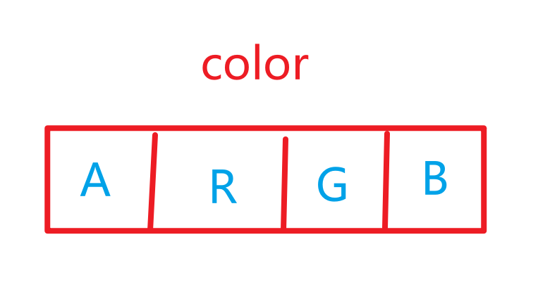
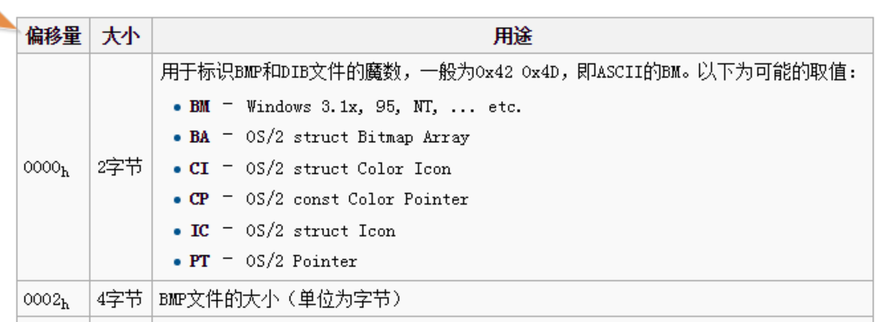
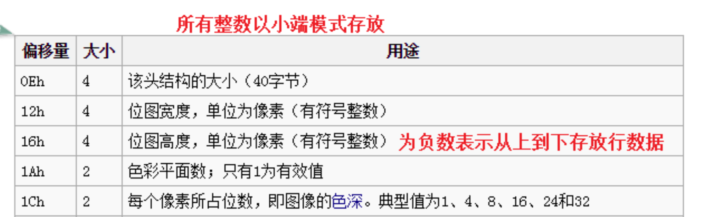

### 一、LCD显示

#### 1.1 LCD基础知识

**像素**

>最小的图像单位，这个小的图像的单位能在屏幕上显示单个颜色
>
>我们的开发板是 800*480的像素

**分辨率**

>图像的分辨率越高，它包含的像素越多，图像越清晰，效果更好
>
>把图像想象成一个棋盘，棋盘上的格子就可以看做是像素点

**色深**

>也称色位深度，决定了一个像素点可以显示多少种颜色
>
>本质上是决定一个像素点所占空间的大小，单位是bit, 典型的色深 8bit, 16bit, 24bit, 32bit
>
>1bit      0/1                  两种颜色
>2bit      00/01/10/11  四种颜色
>...............
>
>一个像素点可以显示的颜色 = 2^色深

**三原色**

>RGB 红绿蓝(光学)
>
>我们通过控制颜色分量的浓度组合从而控制像素点显示的颜色

我们的开发板的显示屏是32位色深，也就是说我们显示屏一个像素点由32bit(4字节)数据来描述

 

```c
在色深32位的图片中，还有一个颜色分量
	A --> 透明度 (我们一般不使用，默认写0)

每一个颜色分量对应了一个字节(0 ~ 255)
	0表示没有当前颜色分量
	255表示当前颜色分类浓度达到最高

我们一般通过十六进制来描述一个颜色
	0xFF0000    --->    红色
	0x00FF00    --->    绿色
	0x0000FF    --->    蓝色
	0x00		--->    黑色
	0xFFFFFF    --->    白色
```

#### 1.2 write操作屏幕

屏幕操作和文件操作是一样的
但是屏幕文件和普通文件有点不同
我们叫硬件对应的文件为设备文件(驱动)
我们操作屏幕就是在操作这个设备文件
这个设备文件对应的位置  --->  **/dev/fb0**

操作流程:

>1、打开显示屏文件(open   /dev/fb0)
>
>2、往屏幕中写入数据 (write   800*480个像素点，一个像素点占4个字节)
>
>3、关闭屏幕文件(close)

### 二、内存映射

把文件与内存中的一块空间建立映射关系，我们之后只需要操作这块内存空间就相当于操作这个文件对应的空间，这个操作称之为**内存映射**

假设，现在我们已经建立了内存和屏幕文件的映射关系

```C
*plcd   ---->     屏幕的第0行的第0个像素点
*(plcd + 1)  ---> 屏幕的第0行的第1个像素点
*(plcd + 799)  ---> 屏幕的第0行的最后1个像素点
*(plcd + 800)  ---> 屏幕的第1行的第0个像素点
*(plcd + 800 + 799)  ---> 屏幕的第1行的最后1个像素点

问:	第y行的第x个像素点怎么描述? (x, y)
		*(plcd + 800*y + x)

void lcd_draw_point(int x, int y, unsigned int color)
{
    if(x >= 0 && x < 800 && y >= 0 && y < 480)
    {
        *(plcd + 800*y + x) = color;
    }
}
```

plcd 怎么来?

​		Linux操作系统提供了一个函数
**mmap: memory map  内存映射**

```c
NAME
       mmap, munmap - map or unmap files or devices into memory

SYNOPSIS
       #include <sys/mman.h>

	功能: 内存映射
void *mmap(void *addr, size_t length, int prot, int flags,int fd, off_t offset);
	addr: 把文件映射到内存的哪个位置，一般写NULL, 表示由操作系统自行分配映射位置
	length: 映射区域的大小  800*480*4
	prot: 映射区域的权限
	   PROT_READ  Pages may be read.    可读
       PROT_WRITE Pages may be written. 可写
	   如果需要使用多个权限，中间用 | 进行连接
	   如:  PROT_READ | PROT_WRITE  可读可写
	flags: 标志位，两种情况
		MAP_SHARED	 共享映射，操作立马响应
        MAP_PRIVATE  私有映射，操作不可见
	fd: 需要映射的文件对应的文件描述符
	offset: 偏移量，从文件的哪个的位置开始映射，一般写0，从文件开头进行映射
返回值:
	成功返回映射区域的首地址  plcd
	失败返回MAP_FAILED， 同时errno被设置

	功能: 解除映射
int munmap(void *addr, size_t length);
	addr: 需要解除映射区域的首地址
	length: 需要解除映射区域的大小
```

**内存映射操作显示屏步骤:**

>1、打开显示屏(open  /dev/fb0)
>
>2、内存映射(mmap)
>
>3、操作映射区域 (描点函数)
>
>4、解除映射(munmap)
>
>5、关闭显示屏(close)

### 三、BMP图片显示

BMP图片:  微软制定的一种无压缩的图片文件格式

图片也是普通文件
		普通文件中有特定格式的二进制文件
		也就是说，我们得按照指定的格式去读取图片中的数据

**文件头**

```c
BITMAP文件头 + DIB头  ： 存储文件的属性信息
	14 + 40  ----> 54字节
```

 

**魔数**

```c
可以根据魔数来判断该图片是否为BMP图片

char BM[2] = {0};
read(fd_bmp, BM, 2);
```

**文件大小**

```c
int size;
lseek(fd_bmp, 0x02, SEEK_SET); //从文件开头偏移2个字节的位置
read(fd_bmp, &size, 4);
```

 

**宽度、高度**

```c
宽度: 一行有多少像素点
高度: 一共有多少行像素点

int width, height;
lseek(fd_bmp, 0x12, SEEK_SET);
read(fd_bmp, &width, 4);
read(fd_bmp, &height, 4);

width > 0: 每一行的像素点从左往右存放
width < 0: 每一行的像素点从右往左存放
height > 0: 每一列的像素点从下往上存放
height < 0: 每一列的像素点从上往下存放
```

**色深**

```c
是指每个像素点占多少bit
depth = 24  像素点占24bit(3字节)  --->  RGB

short depth;
lseek(fd_bmp, 0x1C, SEEK_SET);
read(fd_bmp, &depth, 2);
```

**调色板(颜色值数组)**

```
色深如果是24位或者32位是没有调色板这一部分的，所以我们不作考虑了
```

**像素数组**

```c
保存每一个像素点的颜色分量值(RGB)

我们需要先开辟一块跟像素数组一样大的存储空间，将像素数组中的每一个元素值读取到我们开辟的空间中去

问题: 我们开辟的空间多大?
    文件总大小 = 文件头大小 + 像素数组大小
	像素数组大小 = 文件总大小 - 文件头大小
    		   = size - 54
```


**BMP图片的制作**

用电脑的画图打开图片  --->  修改图片大小  ---->  另存为  --->  BMP图片(24位位图)


作业:
			每隔3秒，图片自动进行切换

```c
main()
{
    .......
    
    while(1)
    {
        显示图片1
        sleep(3); //延时3秒
        显示图片2
        sleep(3);
    }
        
    .......
}
```


