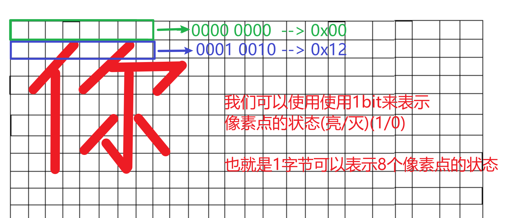
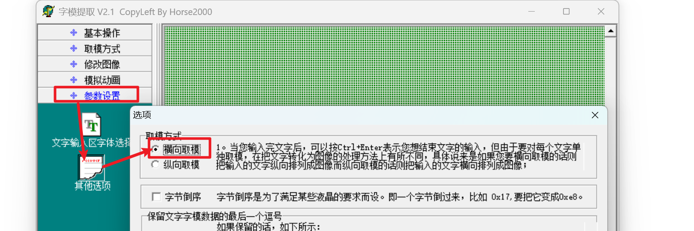

### 一、文字显示

#### 1.1 字符取模软件的使用

 

在屏幕上显示字符，本质就是按照一定的规则显示对应的像素点
		**点阵液晶取模**

该软件  把字符按照一定的规律  变成16进制的数据

(1) 参数设置
		字体、字号
		**其他选项  ---->  取模方式: 横向取模**

 


（2） 在文字输入区
			输入你想要显示的字符   ---》 输入完成之后按  Ctrl + Enter 进行确认


（3） 取模方式
			选择C51


（4）点阵生成区，生成了对应的数据

```c
/*--  文字:  徐  --*/
/*--  微软雅黑14;  此字体下对应的点阵为：宽x高=19x25   --*/
/*--  宽度不是8的倍数，现调整为：宽度x高度=24x25  --*/
0x00,0x00,0x00,0x00,0x00,0x00,0x00,0x00,0x00,0x00,0x00,0x00,0x0C,0x1C,0x00,0x1E,0x3C,0x00,0x1C,0x3E,0x00,0x38,0x77,0x00,0x70,0xE3,0x00,0x6F,0xE3,0x80,0xEF,0xC1,0xE0,0x1F,0xFF,0xE0,0x38,0x1C,0x00,0x38,0x1C,0x00,0x78,0x1C,0x00,0xFB,0xFF,0xE0,0xF8,0x1C,0x00,0x39,0xDF,0x00,0x3B,0x9F,0xC0,0x3F,0x9D,0xE0,0x3F,0xDC,0xE0,0x38,0xF8,0x00,0x00,0x00,0x00,0x00,0x00,0x00,0x00,0x00,0x00,


一个数据就是一个字节，一个字节占8bit, 可以描述8个像素点的亮灭状态
```

#### 1.2 显示

是取模的逆操作，把数据还原成字符

(1) 首先把数据保存起来，数组保存

```c
char word[宽度*高度/8] = {xxx};
```

(2) 显示

```c
解析每一个bit, 如果该bit是1， 显示对应的颜色
使用 &1 来判断该bit是否为0

	xxxx xxxY
&   0000 0001
--------------------
    0000 000Y
如果按位运算之后的结果为真(非0)，则表示对应的像素点需要进行显示
一个一个bit进行判断
```

### 二、触摸屏

Linux触摸屏事件，在系统中所有输入事件存储在输入子系统中，输入设备(键盘、鼠标、触摸屏)都对应一个文件名。

触摸屏的文件名 **/dev/input/event0**

所有的输入事件保存在一个结构体中
		input_event

保存 /usr/include/linux/input.h

```c
struct input_event {
	struct timeval time; //该事件发生的时间
    
	__u16 type; //事件类型
    	EV_KEY	按键事件
		EV_REL  鼠标事件
		EV_ABS  触摸屏事件
    
	__u16 code; //code根据事件的不同有不同的含义
		if(type == EV_EKY)  code为按键的键值
			#define BIN_TOUCH 0x14a //触摸屏按键
		if(type == EV_ABS)  code是标识符
            ABS_X  --> 表示当前value的值为触摸点横坐标的数据
			ABS_Y  --> 表示当前value的值为触摸点纵坐标的数据
    
	__s32 value; //根据事件类型的不同有不同的含义
    	if(type == EV_KEY)  value 有两个值  1/0 按键按下/按键抬起
		if(type == EV_ABS)  value根据code的值来表示具体的坐标数据
};

获取触摸点坐标:
	type == EV_ABS && code == ABS_X ==>  x = value
	type == EV_ABS && code == ABS_Y ==>  y = value

触摸屏的坐标范围:
	x [0, 1024)
	y [0, 600)
       
和显示屏不一样
对于板子的同一个位置
	X像/800 = X触/1024
	Y像/480 = Y触/600

也可以如下近似转换:
	X像 = X触/1.25
	Y像 = Y触/1.25      
```

作业:

​			手动控制图片切换
​			大家参考左右滑动，完善程序，实现上下滑动的判断
​			左右滑动控制图片切换(上一张、下一张)	


